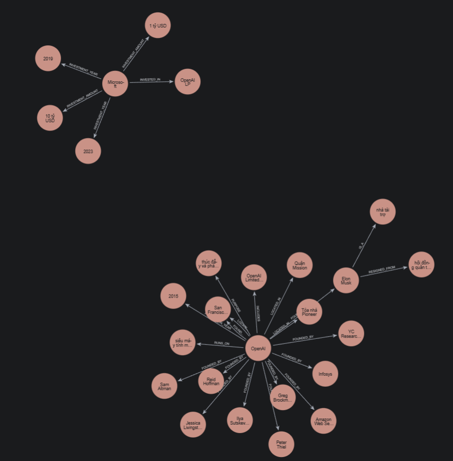

# 🧠 GraphRAG vs Flat RAG - Lab Day 19

Dự án so sánh hiệu năng giữa **GraphRAG (Knowledge Graph based RAG)** sử dụng Neo4j và **Flat RAG (Vector based RAG)** sử dụng ChromaDB trên tập dữ liệu "Tech Company Corpus".

---

## 📊 Benchmark Report (Kết quả hiện tại)

Dưới đây là tóm tắt kết quả so sánh giữa hai hệ thống dựa trên tập câu hỏi thử nghiệm:

| Hệ thống | Điểm TB (thang 10) | Avg Latency (Thời gian) | Avg Cost (Tokens / Truy vấn) |
|---|---|---|---|
| **Flat RAG** | **6.1/10** | **2.22 giây** | 721 tokens |
| **Graph RAG** | **4.9/10** | 6.01 giây | 1264 tokens |

> [!NOTE]
> Kết quả chi tiết có thể được tìm thấy tại [benchmark_report.md](./benchmark_report.md) và [benchmark_report.csv](./benchmark_report.csv).

---

## 🔍 Phân tích Failure Modes (Lý do sai sót)

Mặc dù GraphRAG có khả năng kết nối dữ liệu tốt, nhưng nó vẫn gặp một số lỗi chính:

1. **🧩 Lỗ hổng Tri thức (Incomplete Graph)**: Đôi khi các thực thể không được trích xuất đầy đủ hoặc bị trùng lặp với tên gọi khác nhau.
2. **🎯 Độ chính xác khi tìm Seed Node**: Vector search có thể tìm sai node bắt đầu nếu tên thực thể trong câu hỏi quá ngắn hoặc mơ hồ.
3. **📜 Mất mát Ngữ cảnh**: Chuyển đổi văn bản sang dạng bộ ba (Triples) làm mất đi các chi tiết miêu tả dài và số liệu cụ thể.

---

## 🚀 Installation & Usage

### 1. Yêu cầu hệ thống
- Python 3.10+
- Docker & Docker Compose (để chạy Neo4j)
- OpenAI API Key

### 2. Cài đặt
Cài đặt các thư viện cần thiết:
```bash
pip install -r requirements.txt
```

### 3. Cấu hình môi trường
Tạo file `.env` từ file mẫu và điền thông tin của bạn:
```bash
cp .env.example .env
```

### 4. Khởi chạy Neo4j
Sử dụng Docker Compose để khởi động database Neo4j:
```bash
docker-compose up -d
```

### 5. Thực thi pipeline
Dự án bao gồm các bước chính sau:

1. **Thu thập dữ liệu**:
   ```bash
   python fetch_data.py
   ```
2. **Xây dựng đồ thị (Indexer)**:
   ```bash
   python -m src.indexer
   ```
3. **Chạy đánh giá (Evaluation)**:
   ```bash
   python -m src.evaluate
   ```

---

## 🛠️ Công nghệ sử dụng
- **LLM**: GPT-4o-mini (via OpenAI)
- **Graph Database**: Neo4j
- **Vector Database**: ChromaDB
- **Framework**: LangChain, Pydantic
- **Đánh giá**: Heuristic scoring (thang điểm 10)
